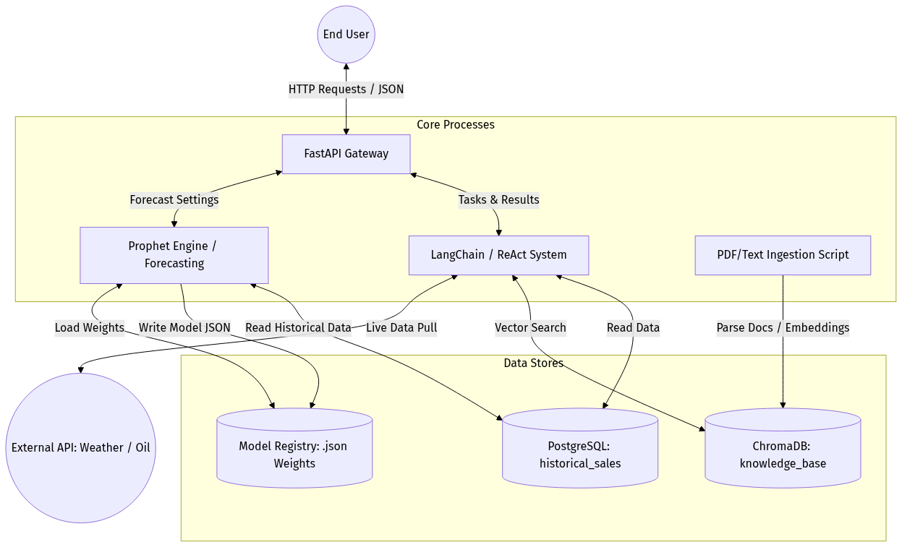

# 📈 Sales Forecasting & Inventory Decision System

An AI-powered sales forecasting and inventory optimization platform built with **FastAPI**, **Facebook Prophet**, and **LangGraph**. It combines time-series forecasting, natural language querying, and RAG-based supply chain intelligence into a single decision support system.



---

## ✨ Features

- **Sales Forecasting** — Prophet-based models with promotion & oil-price regressors
- **Inventory Optimization** — Economic Order Quantity (EOQ), safety stock & stockout probability
- **AI Chat Assistant** — Multi-agent ReAct system (Analyst, Executive, Risk agents) with Text-to-SQL
- **Retrieval-Augmented Generation (RAG)** — Semantic search over internal company documents
- **Anomaly Detection** — Identifies sales spikes and drops against historical baselines
- **Live Market Data** — Real-time oil prices (YFinance) and weather risk (Open-Meteo API)

---

## 🏗️ Architecture

```
Frontend (React)          Backend (FastAPI)           Data Layer
─────────────────    ─────────────────────────    ───────────────────
Dashboard.js      →  /predict                 →  Prophet JSON Models
Inventory.js      →  /inventory               →  PostgreSQL (sales)
ChatAssistant.js  →  /chat → LangGraph Agent  →  ChromaDB (RAG docs)
                     /retrain                 →  model_registry/
```

### Key Components
| Layer | Technology | Purpose |
|-------|-----------|---------|
| Frontend | React + Chart.js | Interactive dashboard & chat |
| Backend API | FastAPI + Uvicorn | REST endpoints, auth, rate limiting |
| Forecasting | Facebook Prophet | Time-series predictions |
| AI Orchestration | LangGraph + LangChain | Multi-agent ReAct loop |
| LLM | OpenAI / GitHub Models | GPT-4o-mini for NL understanding |
| Vector DB | ChromaDB | RAG over supply chain documents |
| Relational DB | PostgreSQL | Historical sales data |

---

## ⚙️ Setup & Installation

### Prerequisites
- Python 3.10+
- Node.js 18+
- PostgreSQL 14+

### 1. Clone the Repository
```bash
git clone https://github.com/your-username/sales-forecasting-prophet.git
cd sales-forecasting-prophet
```

### 2. Configure Environment Variables
```bash
cp .env.example .env
# Edit .env and fill in your actual values
```

Required variables in `.env`:
| Variable | Description |
|----------|-------------|
| `GITHUB_TOKEN` | GitHub PAT for Azure-hosted OpenAI model access |
| `DB_USER` | PostgreSQL username |
| `DB_PASS` | PostgreSQL password |
| `DB_HOST` | PostgreSQL host (`localhost` for local dev) |
| `DB_NAME` | PostgreSQL database name |
| `ADMIN_API_KEY` | API key for securing FastAPI endpoints |
| `ALLOWED_ORIGINS` | Comma-separated list of allowed frontend origins |

### 3. Install Backend Dependencies
```bash
pip install -r requirements.txt
```

### 4. Set Up the Database
Make sure PostgreSQL is running, then load the historical sales data:
```bash
# Create database
createdb SalesForecast

# Load training data (adjust path to train.csv as needed)
# The train_batch.py script will read from the DB
```

### 5. Populate the RAG Knowledge Base
```bash
python ingest_docs.py
```

### 6. Train the Prophet Models
```bash
python train_batch.py
```
This reads from PostgreSQL and saves trained models to `model_registry/`.

### 7. Start the Backend API
```bash
uvicorn main:app --reload --port 8000
```

### 8. Start the Frontend Dashboard
```bash
cd sales-dashboard
npm install
npm start
```
Frontend runs at `http://localhost:3000`, API at `http://localhost:8000`.

---

## 🔌 API Endpoints

All endpoints require the `X-API-Key` header set to your `ADMIN_API_KEY`.

| Method | Endpoint | Description |
|--------|----------|-------------|
| `POST` | `/predict` | Get sales forecast for a store/category |
| `POST` | `/inventory` | Get EOQ & stockout risk analysis |
| `POST` | `/analyze_history` | Detect historical sales anomalies |
| `POST` | `/retrain` | Retrain a Prophet model from DB data |
| `POST` | `/chat` | Multi-agent AI chat assistant |
| `GET` | `/available_categories` | List available store/category combinations |
| `GET` | `/docs` | Interactive Swagger UI |

### Example Request
```bash
curl -X POST http://localhost:8000/predict \
  -H "X-API-Key: your_admin_api_key" \
  -H "Content-Type: application/json" \
  -d '{"store_id": 1, "family": "GROCERY I", "months": 3}'
```

---

## 📁 Project Structure

```
ProphetBased/
├── main.py                  # FastAPI backend (all endpoints + AI agents)
├── train_batch.py           # Batch model training script
├── ingest_docs.py           # RAG document ingestion into ChromaDB
├── forecasting_engine.py    # Standalone forecasting utilities
├── requirements.txt         # Python dependencies
├── .env.example             # Environment variable template
├── .env                     # Local secrets (gitignored)
├── model_registry/          # Trained Prophet models (gitignored)
├── chroma_db/               # ChromaDB vector store (gitignored)
├── knowledge_base/          # Source .txt documents for RAG
├── holidays_events.csv      # Holiday calendar data
├── stores.csv               # Store metadata
├── oil.csv                  # Historical oil price data
├── architecture.txt         # Detailed architecture documentation
└── sales-dashboard/         # React frontend
    ├── src/
    │   ├── Dashboard.js
    │   ├── Inventory.js
    │   └── ChatAssistant.js
    └── package.json
```

---

## 🚀 Deployment Notes

- **`model_registry/`** and **`chroma_db/`** are excluded from git. After deploying, run `train_batch.py` and `ingest_docs.py` to rebuild them.
- Set `DB_HOST` to your cloud PostgreSQL host URL in production (e.g., Supabase, Railway, Neon).
- Set `ALLOWED_ORIGINS` to your frontend's production URL.
- `train.csv` (the raw 116MB dataset) is excluded from git — use your own PostgreSQL import.

---

## 📜 License

This project is for academic and demonstration purposes.
